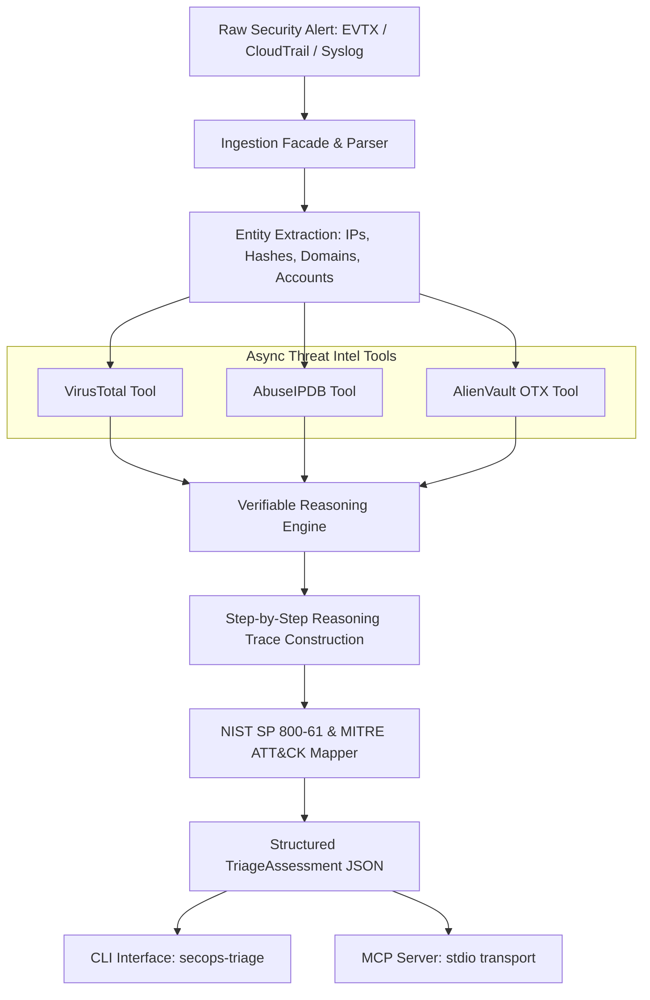

# secops-agent-triage: AI Agentic Security Triage & MCP Workflow

[](https://www.python.org/)
[](https://modelcontextprotocol.io/)
[](pyproject.toml)
[](LICENSE)

`secops-agent-triage` is a portfolio Model Context Protocol (MCP) and CLI security-triage implementation for repeatable Tier 1 SOC alert analysis. It ingests raw security logs (Windows Event Logs, AWS CloudTrail, Syslog), extracts IOC entities, orchestrates configurable threat-intelligence adapters (VirusTotal, AbuseIPDB, AlienVault OTX), constructs inspectable decision traces, and outputs structured JSON assessments with legacy **NIST SP 800-61 Rev. 2-style** phases and **MITRE ATT&CK** technique mappings. NIST SP 800-61 Rev. 3 is the current guidance; deterministic mock mode is provided for offline verification.

---

## ⚡ 60-Second Quick Review Guide

| Key Feature | Implementation Highlights |
|-------------|---------------------------|
| **Multi-Format Ingestion Engine** | Unified facade parsing Windows Event Logs (EVTX EventID 4688, 4624, 4625, 7045), AWS CloudTrail JSON, and Syslog (RFC 5424 / 3164) with Base64 PowerShell payload decoding. |
| **Async Threat Intel Tools** | Parallel async API tools for VirusTotal, AbuseIPDB, and AlienVault OTX with deterministic mock fallback when API keys are omitted. |
| **Verifiable Reasoning Engine** | Emits multi-step `ReasoningStep` traces detailing exact actions taken, observations, logical deductions, and confidence scores for auditability. |
| **Industry Framework Mapping** | Mapping to MITRE ATT&CK technique IDs (e.g. `T1059.001`, `T1110.001`, `T1098`) and legacy NIST SP 800-61 Rev. 2 incident categories (`CAT 1`, `CAT 2`, `CAT 3`). |
| **Dual Interface Architecture** | Standalone CLI (`secops-triage`) and Model Context Protocol (MCP) server supporting stdio transport. |
| **Test Suite & Coverage** | Comprehensive 60-test pytest suite with **93.81% total coverage** testing parsers, tools, engine, CLI, MCP endpoints, and malformed-input resilience. |

---

## 🏗️ Architecture & Data Flow



---

## 🚀 Installation & Setup

```bash
# Clone repository and navigate to folder
cd secops-agent-triage

# Install package in editable mode with test dependencies
pip install -e ".[test]"
```

---

## 💻 CLI Usage

The CLI (`secops-triage` or `python -m secops_agent_triage.cli`) accepts raw logs via string or file, auto-detects formats, and outputs structured `TriageAssessment` JSON.

### 1. Default Sample Run (Windows EventID 4688 Execution)
```bash
secops-triage --mock
```

### 2. File Ingestion
```bash
secops-triage --file sample_cloudtrail.json --format cloudtrail --mock --output-json assessment.json
```

### 3. Inline Raw Alert
```bash
secops-triage --raw "<165>1 2026-08-13T11:00:00Z edge-fw sshd 1234 - - Failed password for root from 192.0.2.1 port 22" --format syslog --mock
```

---

## 🤖 Model Context Protocol (MCP) Server Setup

`secops-agent-triage` exposes MCP tools for integration into AI agent workbenches (e.g. Claude Desktop, VS Code Antigravity IDE):

### MCP Tools Provided:
- `triage_security_alert`: Complete alert ingestion, threat intel lookup, reasoning trace, and NIST/MITRE assessment.
- `lookup_ip_reputation`: Queries VirusTotal, AbuseIPDB, and AlienVault OTX for IP reputation.
- `lookup_hash_reputation`: Queries VirusTotal and AlienVault OTX for file hash reputation.
- `lookup_domain_reputation`: Queries VirusTotal and AlienVault OTX for domain reputation.

### MCP Configuration (`claude_desktop_config.json` or `mcp_settings.json`):
```json
{
  "mcpServers": {
    "secops-agent-triage": {
      "command": "python",
      "args": ["-m", "secops_agent_triage.mcp_server"],
      "env": {}
    }
  }
}
```

Mock mode is the safe default and needs no credentials. For live lookups, set `VT_API_KEY`, `ABUSEIPDB_API_KEY`, and/or `OTX_API_KEY` in the MCP client environment; never commit API keys to the configuration file.

---

## 🧪 Testing & Coverage

Run the unit and integration test suite:

```bash
pytest --cov=secops_agent_triage --cov-report=term-missing --cov-fail-under=90
```

### Test Coverage Results:
```
TOTAL: 773 statements, 93.81% coverage
All 60 test cases PASSED.
```
